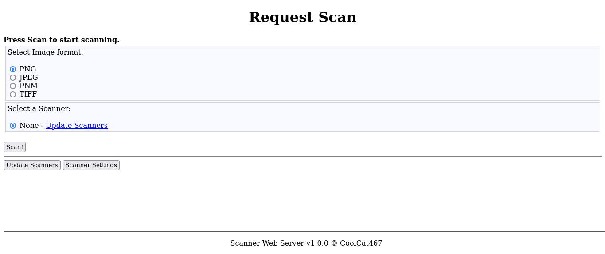

# Scanner-Server
Kind of like CUPS but it's for scanning, not printing.

[](https://github.com/CoolCat467/Scanner-Server/actions/workflows/ci.yml)
<!-- BADGIE TIME -->

[](https://results.pre-commit.ci/latest/github/CoolCat467/Scanner-Server/main)
[](https://github.com/pre-commit/pre-commit)
[](https://github.com/psf/black)

<!-- END BADGIE TIME -->



This is basically a web interface for scanner devices through the SANE (Scanner Access Now Easy) interface.

This program is intended to be used alongside CUPS, but this should not be required.

On default, the web server is hosted on port `3004`.
This can be changed in the configuration file (more info below)

You will need `libsane-dev` to be able to install `python-sane`.
Use APT or your system's equivalent to install.

## Installation
```console
sudo apt-get install libsane-dev
pip install git+https://github.com/CoolCat467/Scanner-Server.git
```

## Run
Important: When you run this program, the configuration file will be saved in `$XDG_CONFIG_HOME/sane_scanner_webserver` (`~/.config` if $XDG_CONFIG_HOME not set) and the logs folder will be saved in
`$XDG_DATA_HOME/sane_scanner_webserver` (`~/.local/share/` if $XDG_DATA_HOME not set)
and the program will create these files if they do not exist.
```console
sanescansrv
```

## Usage
Go to URL `http://<IP_of_host>:3004`


## Configuration
The main configuration file is saved either in `$XDG_CONFIG_HOME/sane_scanner_webserver/config.toml` or
`$HOME/.config/sane_scanner_webserver/config.toml`,
where you can change things like what port(s)
the webserver is hosted on, hypercorn configuration, and enabling
SSL support!


## Enabling SSL Support
If you would like to enable SSL support on the local network, it's a bit
tricky but it's doable, successfully tested in production, and completely free!
1) Make sure your internet router is set to have the machine running
the webserver to have a static ip address. This does not and should not be
a publicly accessible ip address.
2) Create a free account with [duckdns](https://www.duckdns.org/)
3) Add a domain with a name of your choice and set the ip to the static ip
address of the machine running the webserver.
4) Install certbot on the machine running the webserver.
(https://certbot.eff.org/instructions)
When it asks `software`, tell them `other`.
For my installation, I ended up [installing it with pip](https://pypi.org/project/certbot/).
5) Install the [certbot duckdns plugin](https://github.com/infinityofspace/certbot_dns_duckdns) for certbot
6) Either run certbot from duckdns plugin's README or run [/scripts/cert_create.sh](https://github.com/CoolCat467/Scanner-Server/blob/main/scripts/cert_create.sh) with your details.
7) Setup autorenewal from [certbot wiki](https://eff-certbot.readthedocs.io/en/latest/using.html#setting-up-automated-renewal) or look at [/scripts/cert_renew.sh](https://github.com/CoolCat467/Scanner-Server/blob/main/scripts/cert_renew.sh)
8) Uncomment SSL lines in the webserver configuration file (see section above) and edit as needed for your particular setup.


### Links
* Source Code - https://github.com/CoolCat467/Scanner-Server.git
* Issues      - https://github.com/CoolCat467/Scanner-Server/issues

### License
-------
Code and documentation are available according to the GNU General Public License v3.0 (see [LICENSE](https://github.com/CoolCat467/Scanner-Server/blob/HEAD/LICENSE)).
